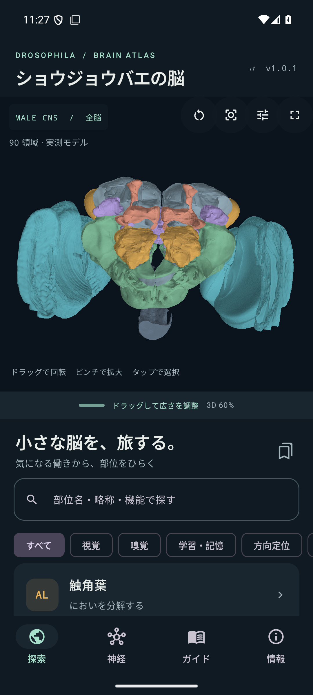
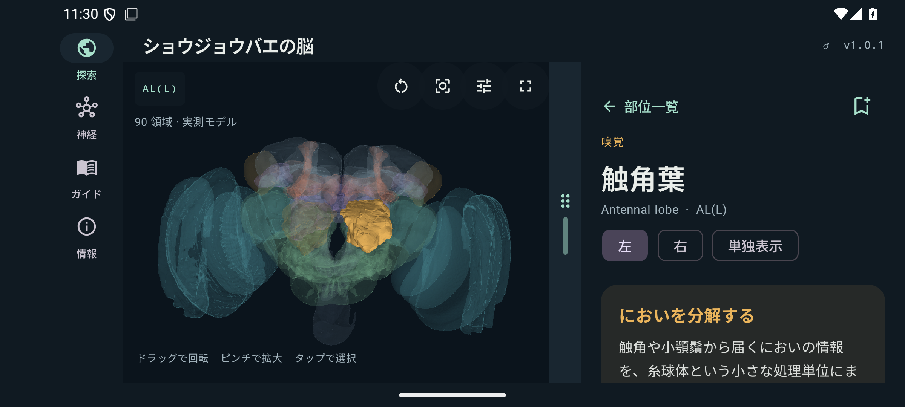
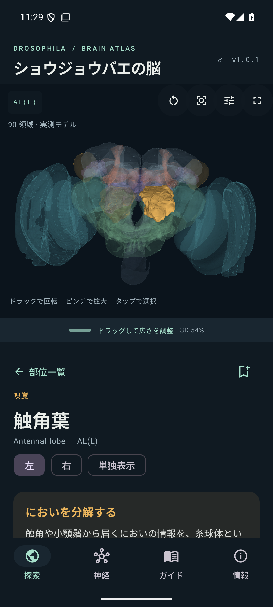

# ショウジョウバエの脳

MaleCNS v1.0の実測データを使ったAndroid向け3D神経解剖アトラス。
Google Playでの有料買い切り配布を想定しています。

**MaleCNSデータはCC BY 4.0で商用利用可能です。**
[利用条件の判断](docs/COMMERCIAL_USE.md)と
[出典・変更・第三者ライセンス](THIRD_PARTY_NOTICES.md)を記録し、アプリ内にも表示しています。

## できること

- 左右を含む **90個の脳領域モデル** を回転・拡大・移動。モデルをタップして選択。
- **3Dと解説の境界をドラッグして調整**。縦・横それぞれの割合を保存。3D最大表示と分割表示の切り替え。
- **元の7,712,880三角形を保持**。8GB端末では高精細を初期設定で有効にし、操作中だけ軽い形状を使用。
- **50種類の部位解説**。主な機能、回路、3Dでの観察ポイント、科学的な限界、原著論文へのリンク。
- 全CNSの **165,122個の追跡済み神経** を細胞型・細胞ID・分類で検索。
- それらの間の **25,563,197本の有向接続**（合計 **124,025,046** 化学シナプス）をオフライン収録。
  接続数の小さいものも含め、多い順に入力・出力を表示し、相手をたどれます。
- **523個の神経形態を同梱**。それ以外の個別形態は公式の公開ストレージから取得・キャッシュ。
- 部位と神経の保存、機能別の検索、領域の単独表示、透過度調整、学習ガイド。
- 日本語UI。広告、アカウント登録、アプリ内課金、分析SDKなし。

## 画面

  

## 表示とデータの範囲

**全脳の領域地図**と**神経の概観**は異なります。90個の領域は公式の
`rois/fullbrain-roi-v4` に由来する脳の区画です。神経の概観は523個の実測細胞が持つ
**2,237,417本の枝を静止時に全て表示**します。操作中は細胞数を一時的に減らします。
全165,122細胞・全シナプスを同時描画するものではありません。
個別表示は公式の中心線形態を表示します。細胞の表面メッシュや発火シミュレーションではありません。

検索・接続の対象は公式注釈の `status=Traced` の細胞です。グリア・孤立断片・未追跡の
断片は含みません。元の全接続表には151,856,684行あり、そのうち両端が追跡済みの
25,563,197行を重みの閾値なしで保持しています。すべての元セグメント間の接続を
収録したという意味ではありません。

「脳に関係する分類」は144,717細胞です。公式 `superclass` が `vnc_` で始まるものと
`ENS`、`efferent_ascending` を除外する分類フィルターです。細胞の分枝が脳の領域に
実際に入るかを空間判定したフィルターではありません。制限を外すとCNS全体を検索できます。
腹側神経索の領域メッシュは同梱していませんが、下行・上行神経の脳外への分枝は
個別形態に含まれます。

未知の部位機能を補って断定することはせず、特に小領域や `CV-anterior` / `CRN` は
解剖的な説明と未確定の内容を区別します。機能説明は別個体・成虫雌などの原著研究も
根拠とし、MaleCNS標本で全細胞の機能が直接測定されたとする主張はしません。

## 広さと精細度

境界のハンドルを縦画面では上下、横画面では左右へドラッグできます。
3Dの割合は20〜85%で調整でき、右上の最大化ボタンで3D表示に集中できます。
設定ダイアログのスライダーからも調整でき、TalkBackの増減操作にも対応します。
横画面ではナビゲーションを左側へ移し、縦方向の表示領域を確保しています。

高精細な全脳表示は実RAMが6GiB以上の非Low-RAM端末で初期状態から有効です。
「元の領域形状で表示」で切り替えられ、選択部位は常に元の形状を使用します。
操作中と神経表示の背景は最大20,000三角形/領域のモデルを使用します。
1MiBの転送用バッファを再利用してGPUへ送り、全モデルをJava配列や
ネイティブバッファにも重複保持することはありません。GPU形態バッファの上限は256MiBです。
これはアプリ全体のメモリ使用量や、全8GB端末の動作保証を意味しません。

## 実行・開発

- JDK 17、Android SDK platform 36 / build-tools 36.0.0
- Gradle 8.14.3 wrapper、Android Gradle Plugin 8.13.2、Kotlin 2.2.20
- Android 9以上、OpenGL ES 2.0対応端末
- 初回起動では約160MiBのSQLiteデータをアプリ専用領域へ展開するため、その分の空き容量が必要。
- ネットワークから取得する形態ファイルは64MiB以下。キャッシュ上限192MiB。

```sh
# local.properties に自分のSDKの場所を記載
./gradlew :app:assembleDebug :app:testDebugUnitTest :app:lintDebug
./gradlew :app:connectedDebugAndroidTest
```

このNixOS環境でのビルドには以下の引数を追加します。

```sh
-Pandroid.aapt2FromMavenOverride=/home/takeshi/Android/Sdk/build-tools/36.0.0/aapt2
```

依存関係とデータは開発者環境で取得しますが、アプリはAPIトークン・neuPrintアカウントを要求しません。

## データを再生成する

アプリに加工済みのモデルとDB分割ファイルを同梱しているため、通常のビルドで再取得は不要です。
高精細モデルは `atlas_models/src/main/assets/atlas`、その他は `app/src/main/assets/atlas` にあります。

```sh
python3 -m venv .venv
.venv/bin/pip install -r tools/requirements.txt
.venv/bin/python tools/write_regions.py
.venv/bin/python tools/prepare_data.py
.venv/bin/python -m pytest tools/test_data.py -q
```

NixOSでPython wheelが `libstdc++.so.6` を見つけられない場合は、上記のPython実行に
`LD_LIBRARY_PATH=/run/current-system/sw/share/nix-ld/lib` を設定します。
初回は約1GBの接続表、注釈、領域メッシュ、形態を取得します。
生データは `data/source/` にキャッシュされGit対象外です。

- [データの構造](data/README.md)
- [出典とハッシュ](data/provenance/manifest.json)
- [日本語解説](data/regions.json)
- [検証記録](docs/VALIDATION.md)
- [Google Play公開手順・掲載文](docs/PLAY_RELEASE.md)
- [プライバシーポリシー](https://hatake716.github.io/syoujoubae-noumiso/privacy.html)

[精細度とメモリの測定](docs/PERFORMANCE.md)に、エミュレーターとPixel 10aの結果を記録しています。

## リリースビルド

`keystore.properties.example` を参考に、鍵の場所とパスワードを `keystore.properties` に設定します。
秘密情報はGitから除外されています。設定がない場合、releaseの署名は行いません。

モデルを含むAPKの生成には [bundletool 1.18.3](https://github.com/google/bundletool/releases/tag/1.18.3) を
`data/source/bundletool.jar` に配置してください（または `BUNDLETOOL_JAR` を指定）。

```sh
./gradlew :app:bundleRelease :app:lintRelease
python3 tools/release_apks.py
```

Google Play向けは `app/build/outputs/bundle/release/app-release.aab` です。
高精細モデルは `atlas_models` のinstall-time asset packとして、本体と同時にインストールされます。
直接インストール用は `tools/release_apks.py` が同じAABから生成する全データ入りのAPKを使います。
`assembleRelease` 単独のAPKには高精細パックが入らないため、配布しないでください。
署名付きビルドを作成しても、Google Playへの審査申請・公開は行われません。

## 権利

アプリ独自コード・日本語解説：Copyright © 2026 hatake716. All rights reserved.
MaleCNS由来データ：CC BY 4.0。第三者ソフトウェアはそれぞれのライセンス。
詳細は [LICENSE](LICENSE) と [THIRD_PARTY_NOTICES.md](THIRD_PARTY_NOTICES.md) を参照。
元データ・加工済みデータはアプリを購入しなくても利用条件に従って再利用できます。
